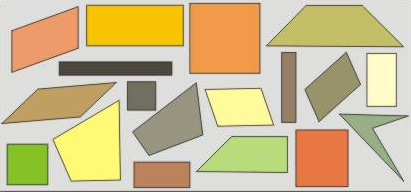
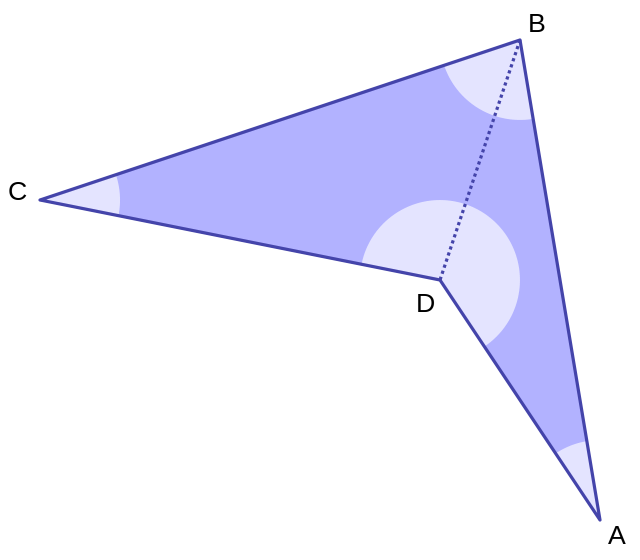
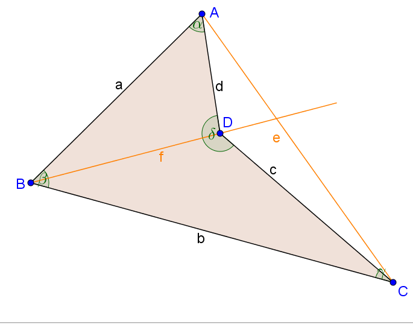
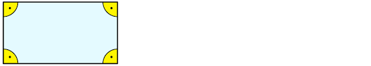
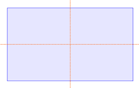

# Definieren

Unter einer Definition versteht man im Allgemeinen die **genaue Abgrenzung eines Begriffes** innerhalb eines größeren Zusammenhangs. Dabei darf und muss man natürlich andere Begriffe verwenden.

Ein Begriff wird dabei durch eine **Beschreibung** oder **Erklärung** dessen, was er bezeichnet, genau bestimmt. Ist das geschehen, kann man andersherum für jedes Objekt angeben, ob es unter den Begriff fällt oder nicht. Die unter der Definition zusammengefassten Objekte sind dann bezüglich der in der Definition genannten Merkmale gleichartig.

#### Beispiel 1 {-}

Gib eine Definition für das Viereck an.

`r hide("Vorschlag")`

Ein Viereck ist eine geometrische Figur in der Ebene, die vier Ecken hat.

#### {-}

Betrachte folgenden Zoo der Vierecke:



Überlege dir Antworten auf folgende Fragen:

+ Fallen alle diese Vierecke unter die oben vorgeschlagene Definition?

+ Möchtest du eines oder mehrere ausschließen?

+ Falls ja, musst du dafür die Definition ändern? Wie sollte sie deiner Ansicht nach lauten?


#### Beispiel 2 {-}

Wie du feststellst und sicher schon oft festgestellt hast, gibt es Vierecke in zahlreichen Variationen. Oft möchte man sogenannte konkave Vierecke ausschließen. Das ist ein konkaves Viereck:



Ändere die Definition so ab, dass konkave Vierecke ausgeschlossen sind.

`r hide("Tipp")`

Überlege dir, wodurch sich konkave Vierecke auszeichnen.

#### {-}

`r hide("Vorschlag")`

Konkave Vierecke zeichnen sich dadurch aus, dass der Schnittpunkt der Diagonalen bei ihnen außerhalb des Vierecks liegt. Hier ein Beispiel:



Man könnte also einschränken:

Unter einem Viereck verstehe ich eine geometrische Figur in der Ebene, die genau vier Ecken hat und für die gilt, dass sich ihre Diagonalen im Inneren der Figur schneiden.

#### {-}

Jetzt können wir uns daran machen, Ordnung in den Zoo der Vierecke zu bringen. Wir klassifizieren sie. Dabei helfen natürlich weitere Definitionen.


#### Beispiel 3 {-}

Definiere Rechteck.

`r hide("Vorschlag 1")`

Ein Viereck, das vier rechte Winkel hat, heißt Rechteck.



#### {-}

`r hide("Vorschlag 2")`

Ein Viereck, dessen Mittelsenkrechten Symmetrieachsen sind, heißt Rechteck.



#### {-}

Überprüfe diese Definitionen, indem du überlegst, ob alle Rechtecke darunter fallen und andere Vierecke ausgeschlossen werden.

Und jetzt bist du an der Reihe!


```{r, eval=knitr::opts_knit$get("rmarkdown.pandoc.to") == "html", results='asis', echo=FALSE}
cat('<hr style="background-color:#3C6690;height:2px">')
```

#### Aufgabe 1 {-}

Gib für folgende besondere Vierecke eine Definition an.

a) Parallelogramm

`r hide("Lösungsvorschlag")`

Ein Parallelogramm ist ein Viereck mit paarweise parallelen Seiten.

#### {-}

b) Quadrat

`r hide("Lösungsvorschlag")`

Ein Quadrat ist eine Raute mit vier rechten Winkeln.

#### {-}

c) Trapez

`r hide("Lösungsvorschlag")`

Ein Trapez ist ein Viereck mit einem Paar paralleler Seiten.

#### {-}

d) Raute

`r hide("Lösungsvorschlag")`

Eine Raute ist ein Viereck mit vier gleich langen Seiten.

#### {-}

`r hide("Tipp")`

Dies sind mögliche Eigenschaften, an die du bei deiner Definition denken könntest:

+ parallele Gegenseiten

+ gleich lange Gegenseiten

+ gleich lange Diagonalen

+ gleichseitig

+ gleichwinklig

+ rechtwinklig

+ punktsymmetrisch

+ achsensymmetrisch

#### {-}

```{r, eval=knitr::opts_knit$get("rmarkdown.pandoc.to") == "html", results='asis', echo=FALSE}
cat('<hr style="background-color:#3C6690;height:2px">')
```

#### Aufgabe 2 {-}

Gib für folgende besondere Dreiecke eine Definition an.

a) Rechtwinklige Dreiecke.

`r hide("Lösungvorschlag")`

Ein Dreieck, das einen rechten Winkel hat, heißt rechtwinkliges Dreieck.

#### {-}

b) Gleichschenklige Dreiecke.

`r hide("Lösungsvorschlag")`

Ein Dreieck, das zwei gleich lange Seiten hat, heißt gleichschenkliges Dreieck.

#### {-}

c) Gleichseitige Dreiecke.

`r hide("Lösungsvorschlag")`

Ein Dreieck, dessen drei Seiten alle gleich lang sind, heißt gleichseitiges Dreieck.

#### {-}

```{r, eval=knitr::opts_knit$get("rmarkdown.pandoc.to") == "html", results='asis', echo=FALSE}
cat('<hr style="background-color:#3C6690;height:2px">')
```

#### Aufgabe 3 {-}

Definiere:

a) Mittelsenktrechte

`r hide("Lösungsvorschlag")`

Die Lotgerade durch den Mittelpunkt einer Strecke heißt Mittelsenkrechte der Strecke.

#### {-}

b) Winkelhalbierende

`r hide("Lösungsvorschlag")`

Die Symmetrieachse eines Winkels heißt Winkelhalbierende.

#### {-}

c) Höhe im Dreieck

`r hide("Lösungsvorschlag")`

In einem Dreieck heißt das Lot von einem Eckpunkt zu der Geraden durch die beiden anderen Eckpunkte Höhe im Dreieck. Jedes Dreieck hat deshalb drei Höhen.

#### {-}

d) Lotgerade

`r hide("Lösungsvorschlag")`

Eine Gerade, die senkrecht ist zu einer anderen Geraden, nennt man Lotgerade zu dieser anderen Geraden.

#### {-}

e) Seitenhalbierende des Dreiecks

`r hide("Lösungsvorschlag")`

Die Gerade, die eine Ecke des Dreiecks mit dem Mittelpunkt der gegenüberliegenden Seite verbindet, heißt Seitenhalbierende des Dreiecks.

#### {-}

f) Kreis

`r hide("Lösungsvorschlag")`

Ein Kreis ist eine geometrische Figur in der Ebene, die aus all den Punkten besteht, die von einem gegebenen Punkt (dem Mittelpunkt des Kreises) in dieser Ebene den gleichen Abstand haben.

#### {-}

```{r, eval=knitr::opts_knit$get("rmarkdown.pandoc.to") == "html", results='asis', echo=FALSE}
cat('<hr style="background-color:#3C6690;height:2px">')
```

#### Aufgabe 4 {-}

Welche besonderen Zahlen sind hier definiert?

a) Die Zahlen lassen sich in der Form $2 \cdot n + 1$ mit $n= 0, 1, 2, 3, \ldots$ schreiben.

`r hide("Lösung")`

Die ungeraden natürlichen Zahlen.

#### {-}

b) Die Zahlen haben die Form $5 \cdot n$, wobei $n$ eine natürliche Zahl ist.

`r hide("Lösung")`

Die Vielfachen der Zahl 5.

#### {-}

c) Die Zahlen haben die Form $n^2$ mit $n= 1, 2, 3, 4, \ldots$

`r hide("Lösung")`

Die Quadratzahlen

#### {-}

```{r, eval=knitr::opts_knit$get("rmarkdown.pandoc.to") == "html", results='asis', echo=FALSE}
cat('<hr style="background-color:#3C6690;height:2px">')
```

#### Aufgabe 5 {-}

Definiere folgende Begriffe und überprüfe deine Definition, indem du im Internet, im Lexikon oder in deinen Unterlagen nachliest:

a) Arithmetisches Mittel

`r hide("Lösungsvorschlag")`

Hat man eine Liste (oder Sammlung) von Daten in Form von Zahlen oder Größen gegeben, so ist das arithmetische Mittel (der Mittelwert) dieser Daten der Quotient aus der Summe aller Zahlen oder Größen durch die Anzahl der gegebenen Werte.

#### {-}

b) Absolute Häufigkeit

`r hide("Lösungsvorschlag")`

Die absolute Häufigkeit gibt an, wie oft ein bestimmter Wert in einer Datensammlung vorkommt.

#### {-}


c) Relative Häufigkeit

`r hide("Lösungsvorschlag")`

Die relativen Häufigkeit gibt den Anteil der Elemente einer Datensammlung wider, die alle einen bestimmten (gleichen) Wert haben. Dabei gilt:

$$relative\;Häufigkeit = \frac{absolute\;Häufigkeit}{Gesamtzahl}$$

#### {-}

```{r, eval=knitr::opts_knit$get("rmarkdown.pandoc.to") == "html", results='asis', echo=FALSE}
cat('<hr style="background-color:#3C6690;height:2px">')
```

#### Aufgabe 6 {-}

Erinnere dich an den Anfang des Schuljahres und definiere folgende Begriffe:

a) Steigung einer Geraden

`r hide("Lösungsvorschlag")`

Die Steigung m einer Geraden gibt an, wie steil die Gerade ist: Also um wie viel der y-Wert steigt (fällt), wenn der x-Wert um 1 zunimmt.

#### {-}

b) y-Achsenabschnitt eines Funktionsgraphen

`r hide("Lösungsvorschlag")`

Als y-Achsenabschnitt ($S(0|n)$) bezeichnet man den Schnittpunkt eines Graphen mit der y-Achse.

#### {-}

c) Lineare Funktion

`r hide("Lösungsvorschlag")`

Eine lineare Funktion ist eine Zuordnung $x \rightarrow y$, bei denen man zur Berechnung des y-Wertes eine Gleichung der Form $y=m\cdot x +n$ aufstellen kann.

#### {-}

```{r, eval=knitr::opts_knit$get("rmarkdown.pandoc.to") == "html", results='asis', echo=FALSE}
cat('<hr style="background-color:#3C6690;height:2px">')
```

#### Aufgabe 7 {-}

**Schwer! - Keine Angst vor komischen Wörtern! - Mehrmals lesen hilft!**

Zwei ganze Zahlen $a$ und $b$ heißen kongruent modulo $m$, wenn die Division von $a$ und $b$ durch $m$ den gleichen Rest $r$ lässt.

`r hide("Tipp")`

Versuch dir die Definition an Beispielen greifbar zu machen. Nimm drei ganze Zahlen: Eine Zahl für a, eine für b und eine für m. Und? Was für ein Rest bleibt, wenn du a durch m dividierst (wie in der Grundschule)? Welcher Rest bleibt, wenn du b durch m dividierst? Bleibt der gleiche Rest? Wenn ja, heißen a und b kongruent modulo m.

#### {-}

a) Sind $3$ und $5$ kongruent modulo $2$? Warum?

`r hide("Lösung")`

Ja, denn $3$ und $5$ lassen bei Division durch $2$ denselben Rest:

$3:2 = 1 \quad Rest \; 1 \quad$ und $\quad 5:2 = 2\quad Rest\;1$

#### {-}

b) Sind $3$ und $4$ kongruent modulo $2$? Warum?

`r hide("Lösung")`

Nein, denn $3$ und $4$ lassen bei Division durch $2$ nicht denselben Rest:

$3:2 = 1 \quad Rest \;1 \quad$ und $\quad 4:2=2 \quad Rest \; 0$

#### {-}

c) Sind $5$ und $8$ kongruent modulo $3$? Warum?

`r hide("Lösung")`

Ja, denn $5$ und $8$ lassen bei Division durch $3$ denselben Rest:

$5:3 = 1 \quad Rest \; 2 \quad$ und $\quad 8:3 = 2\quad Rest\;2$

#### {-}

d) Nenne vier Zahlen, die modulo $5$ kongruent sind.

`r hide("Lösung")`

Zum Beispiel die Zahlen $1$, $6$, $11$ und $16$. Dividiert man diese Zahlen durch $5$, so bleibt immer dergleiche Rest: nämlich $1$. Denn:

$1 = 0 \cdot 5 + 1$

$6 = 1 \cdot 5 + 1$

$11 = 2 \cdot 5 + 1$

$16 = 3 \cdot 5 + 1$

#### {-}

e) In Aufgabe 4 wurden besondere Zahlen definiert. In welcher Form lassen sich alle Zahlen schreiben, die modulo $3$ kongruent zu $2$ sind?

`r hide("Lösung")`

Die Forderung, dass die Zahlen modulo $3$ kongruent zu $2$ seien sollen, heißt nichts anderes, als dass bei Division durch $3$ der Rest $2$ bleiben soll. Das ist beispielsweise bei den Zahlen $2$, $5$, $8$ oder $11$ der Fall. Denn:

$2 = 0 \cdot 3 + 2$

$5 = 1 \cdot 3 + 2$

$8 = 2 \cdot 3 + 2$

$11 = 3 \cdot 3 + 2$

Alle diese Zahlen lassen sich also in der Form $n \cdot 3 + 2$ schreiben.

#### {-}

```{r, eval=knitr::opts_knit$get("rmarkdown.pandoc.to") == "html", results='asis', echo=FALSE}
cat('<hr style="background-color:#3C6690;height:2px">')
```
